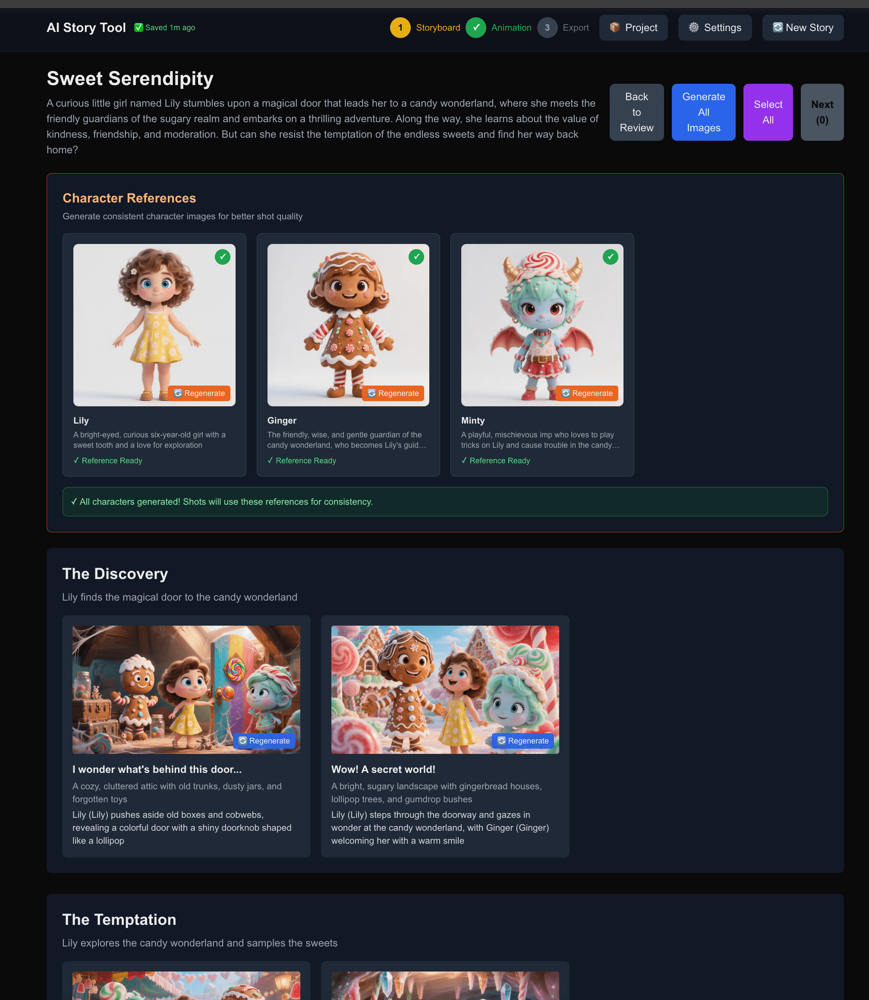

# AI Story Tool

[](https://opensource.org/licenses/MIT)
[](https://nextjs.org/)
[](https://www.typescriptlang.org/)



> **Note**: This is an internal debugging and testing tool for testing the core creation workflow of OpenStoryVideo.com

**Latest Version**: v0.6.0 - Character Confirmation Workflow

## ✨ Core Features

- 🎭 **Character Confirmation Step**: Dedicated character review and generation after AI story generation (NEW v0.6.0)
- 🔄 **Character Regeneration**: Hover over any character to regenerate (NEW v0.6.0)
- ⚡ **Batch Character Generation**: One-click generation of all character reference images (NEW v0.6.0)
- 🚀 **Parallel Generation**: 5x for images, 3x for videos, 10x for audio concurrency, 2-4x speed improvement
- 🎙️ **Automatic Audio**: Auto-generate voiceovers when generating videos, zero additional operations
- 🎬 **Real-time Preview**: Merge video and audio in browser, instant preview before export
- 🤖 **AI Story Generation**: Generate complete stories from one sentence (characters, scenes, storyboards)
- ⚙️ **Global Configuration**: 50+ LLM models, TTS voices, complete customization
- 📊 **Real-time Progress**: Progress bars for all generation operations
- 💾 **Persistent Configuration**: localStorage automatically saves all settings

## Feature Overview

This is a streamlined replica of the Open Story Video creation workflow tool, including the main steps:

### Workflow

**Story with Characters** (AI Generated):

```
Content → Character Confirmation → Storyboard → Edit → Export
  ①              ②                    ③          ④      ⑤
```

**Story without Characters** (Manual Creation):

```
Content → Storyboard → Edit → Export
  ①          ②         ③      ④
```

### Step Details

1. **Content (Content Creation)** - Create story content using JSON Schema forms

   - ✨ AI one-sentence complete story generation
   - Story title and summary
   - Character definitions (supports character reference images)
   - Scene and storyboard settings

2. **Character Confirmation** - 🆕 Dedicated character review and generation step

   - 🎭 **Review AI-generated characters** (name, description, visual prompts)
   - ⚡ **Batch generate all characters** (one-click generate all reference images)
   - 🔄 **Individual character regeneration** (hover to regenerate any character)
   - 📊 **Real-time progress tracking** (shows N/M progress bar)
   - ⏭️ **Skip option** (can choose to skip, generate later)
   - Note: This step only appears when AI story generation includes characters

3. **Storyboard** - Generate storyboard images using Replicate AI

   - 🚀 Parallel generation (5 images simultaneously, 4x speed improvement)
   - 📊 Real-time progress display
   - 🎭 Automatically use character reference images (if generated)
   - Automatically generate images based on descriptions
   - Select images to animate

4. **Edit (Editing)** - Convert static images to animations

   - 🚀 Concurrent video generation (3 simultaneously, 2.5x speed improvement)
   - 🎙️ **Automatic audio generation** (auto-create voiceovers after video completion)
   - 🎬 **Individual preview** (click any shot to preview merged effect)
   - 📊 Real-time progress tracking
   - Use Stable Video Diffusion
   - Preview animation results

5. **Export** - Compose and export final video
   - 🎬 **Batch preview** (preview complete video of all selected shots merged)
   - Browser-side or Docker service export
   - 🎙️ Automatically merge video and audio
   - Automatically add subtitles
   - One-click download complete video

## Tech Stack

- **Next.js 14** - React framework (App Router)
- **TypeScript** - Type safety
- **MobX** - Reactive state management
- **react-jsonschema-form** - Dynamic form generation
- **AI Model Services**:
  - **OpenRouter** - 50+ LLM models (text generation)
  - **Replicate** - Image and video generation
    - FLUX.1 Schnell - Image generation
    - Stable Video Diffusion - Image to video
  - **OpenAI TTS** / **ElevenLabs** - Text-to-speech
- **Video Processing**:
  - **FFmpeg.wasm** - Browser-side video processing
  - **Docker FFmpeg** - Server-side video processing (optional)
- **Tailwind CSS** - Styling framework

## Installation and Setup

### 1. Install Dependencies

```bash
npm install
```

### 2. Configure Environment Variables

Copy `.env.example` to `.env.local`:

```bash
cp .env.example .env.local
```

Edit `.env.local` and add your Replicate API token:

```env
REPLICATE_API_TOKEN=your_token_here
```

Get API token: https://replicate.com/account/api-tokens

### 3. Run Development Server

```bash
npm run dev
```

Visit http://localhost:3000

## Usage Guide

### 🚀 Quick Start (Recommended)

#### Generate Stories with AI One-Sentence

1. On the Content page, find the **AI Story Generator** (purple card)
2. Enter one sentence to describe your story idea, for example:
   - "A little girl discovers the magic of matches on a cold winter night"
   - "A robot learns human emotions in a futuristic city"
3. Click **"Generate Complete Story"**
4. Wait 10-30 seconds, AI will automatically generate a complete story and jump to the next step

Detailed guide: [AI_FEATURES_GUIDE.md](./AI_FEATURES_GUIDE.md)

### 📝 Manual Creation

#### Step 1: Content (Content Creation)

1. Fill in story title and summary
2. Select visual style (3D Cartoon, Anime, Realistic, etc.)
3. Select aspect ratio (16:9, 9:16, 1:1, 4:3)
4. Add character information
5. Create scenes and storyboards:
   - Each scene contains multiple storyboards
   - Each storyboard needs: subtitle, position, content description

Click Submit after completion to proceed to the next step.

#### Step 2: Storyboard

##### 🎭 Generate Character References (Recommended for consistency)

1. In the **Character References** card, click **"Generate All Characters"**
2. Wait for each character's reference image to generate (about 3-5 seconds/character)
3. Green ✓ mark will appear after character generation is complete

##### 🖼️ Generate Storyboard Images

1. Click "Generate All Images" to batch generate all storyboard images
   - System will automatically use character references for consistency
   - Or individually click each storyboard's "Generate Image" button
2. Wait for image generation to complete (using FLUX.1 model)
3. Select storyboards to animate (click image to select)
4. Click "Select All" to select all or manually select
5. Click "Next" to enter editing step

#### Step 3: Edit (Editing/Animation)

1. View selected storyboard images
2. Select images to animate
3. Click "Animate" button to start generating animation
4. Wait for video generation to complete (using Stable Video Diffusion)
5. View and play generated animations
6. Click "Export Video →" after completion to enter export step

#### Step 4: Export (Video Export)

##### Method A: Browser Export (Recommended for quick testing)

1. Select "Browser (FFmpeg.wasm)" option
2. Select video segments to merge
3. Click "Export Video" button
4. Wait for processing to complete (first use requires downloading WASM files)
5. Automatically download merged video file

##### Method B: Docker Export (Recommended for production)

1. Start FFmpeg service:

   ```bash
   npm run docker:ffmpeg
   ```

2. Select "Docker Service" option on export page
3. Select video segments to merge
4. Click "Export Video" button
5. Wait for processing to complete and download

For detailed instructions, see [VIDEO_EXPORT_GUIDE.md](./VIDEO_EXPORT_GUIDE.md)

## Project Structure

```
open-story-video/
├── src/
│   ├── app/
│   │   ├── api/
│   │   │   ├── generate-image/   # Image generation API
│   │   │   ├── generate-video/   # Video generation API
│   │   │   ├── compose-video/    # Video composition API
│   │   │   └── add-audio/        # Audio addition API
│   │   ├── layout.tsx
│   │   ├── page.tsx
│   │   └── globals.css
│   ├── components/
│   │   ├── StoryForm.tsx        # Content creation form
│   │   ├── Storyboard.tsx       # Storyboard view
│   │   ├── EditView.tsx         # Edit/animation view
│   │   └── ExportView.tsx       # Video export view
│   ├── stores/
│   │   └── StoryStore.ts        # MobX state management
│   └── utils/
│       └── videoComposer.ts     # Browser-side video processing
├── assets/                      # Reference screenshots
├── Dockerfile.ffmpeg            # FFmpeg service Docker configuration
├── ffmpeg-service.js            # FFmpeg standalone service
├── docker-compose.yml           # Docker Compose configuration
├── package.json
├── tsconfig.json
├── next.config.js
└── tailwind.config.js
```

## API Documentation

### POST /api/generate-image

Generate images

**Request Body:**

```json
{
  "prompt": "Description text",
  "style": "3D Cartoon",
  "aspectRatio": "16:9"
}
```

**Response:**

```json
{
  "imageUrl": "https://..."
}
```

### POST /api/generate-video

Convert image to video

**Request Body:**

```json
{
  "imageUrl": "https://..."
}
```

**Response:**

```json
{
  "videoUrl": "https://..."
}
```

## Development Notes

1. **API Rate Limiting**: Replicate API has call limits, recommend adding delays during batch generation
2. **Cost Control**: Every API call incurs costs, control usage carefully
3. **Generation Times**:
   - Image generation: ~3-10 seconds
   - Video generation: ~20-60 seconds
4. **Error Handling**: All API calls include basic error handling and user prompts

## Debugging Tips

- Open browser developer tools to view Console logs
- Check Network tab to view API requests and responses
- MobX state can be viewed through React DevTools
- Use "Reset" button to clear current workflow and start over

## Known Limitations

- No user authentication
- No data persistence (data lost on page refresh)
- No advanced editing features (video editing, audio addition, etc.)
- No export functionality
- Fixed AI model parameters

## Future Extension Suggestions

1. Add LocalStorage or database persistence
2. Implement project save and load functionality
3. Add more AI model options
4. Implement video concatenation and export
5. Add audio generation and voiceover features
6. Optimize UI/UX interaction experience
7. Add progress bars and more detailed status indicators

## Contributing

We welcome contributions! Please see our [Contributing Guide](CONTRIBUTING.md) for details.

### Development Setup

1. Fork the repository
2. Create a feature branch:
   ```bash
   git checkout -b feature/amazing-feature
   ```
3. Install dependencies:
   ```bash
   npm install
   ```
4. Make your changes
5. Run tests:
   ```bash
   npm test
   ```
6. Commit your changes:
   ```bash
   git commit -m 'Add amazing feature'
   ```
7. Push to the branch:
   ```bash
   git push origin feature/amazing-feature
   ```
8. Open a Pull Request

### Code Style

- Use TypeScript for type safety
- Follow ESLint configuration
- Use Tailwind CSS for styling
- Write meaningful commit messages

## Roadmap

- [ ] User authentication system
- [ ] Database persistence
- [ ] Advanced video editing features
- [ ] More AI model integrations
- [ ] Real-time collaboration
- [ ] Mobile app support

## Changelog

### v0.6.0 - Character Confirmation Workflow

- ✨ Added dedicated character confirmation step
- ✨ Implemented character regeneration functionality
- ✨ Added batch character generation
- ✨ Improved parallel generation performance

### v0.5.x - Previous versions

- 🎬 Video export functionality
- 🎙️ Automatic audio generation
- 🤖 AI story generation
- 📊 Real-time progress tracking

## Support

If you encounter any issues or have questions:

1. Check the [Issues](https://github.com/your-username/open-story-video/issues) page
2. Create a new issue with detailed information
3. Join our [Discord community](https://discord.gg/your-invite)
4. Check our [Documentation](https://docs.openstoryvideo.com)

## Acknowledgments

- [Next.js](https://nextjs.org/) - React framework
- [Replicate](https://replicate.com/) - AI model hosting
- [OpenRouter](https://openrouter.ai/) - LLM API gateway
- [MobX](https://mobx.js.org/) - State management
- [Tailwind CSS](https://tailwindcss.com/) - CSS framework

## License

MIT License - see [LICENSE](LICENSE) file for details
